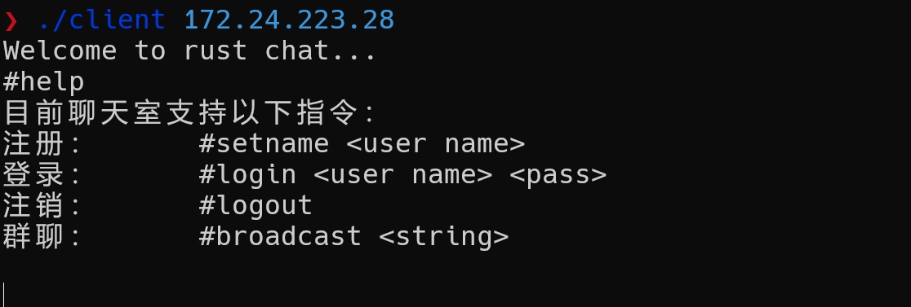
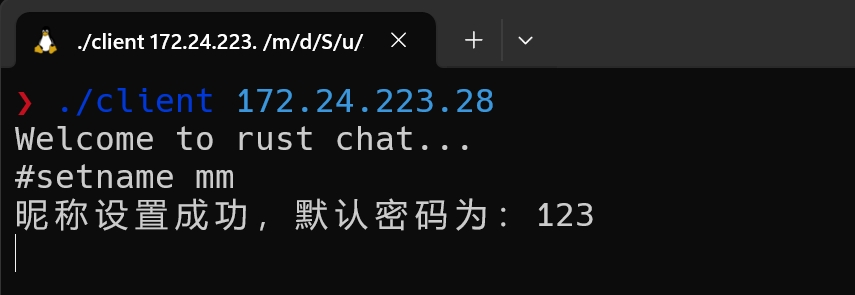
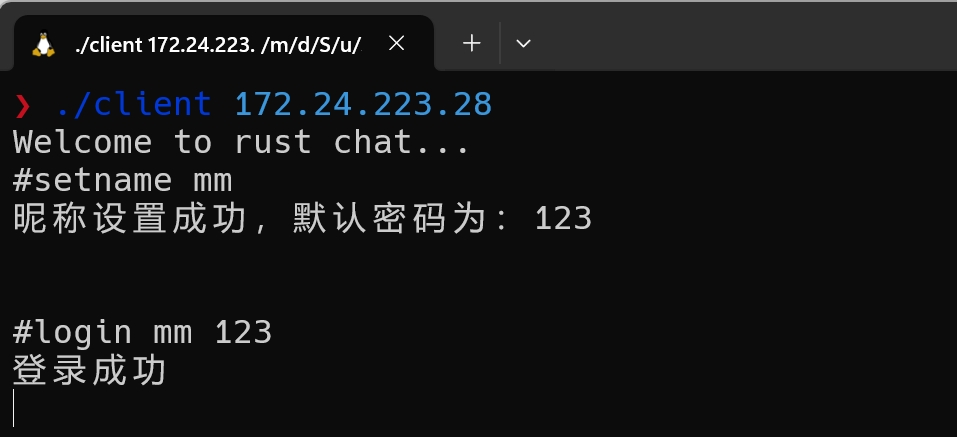
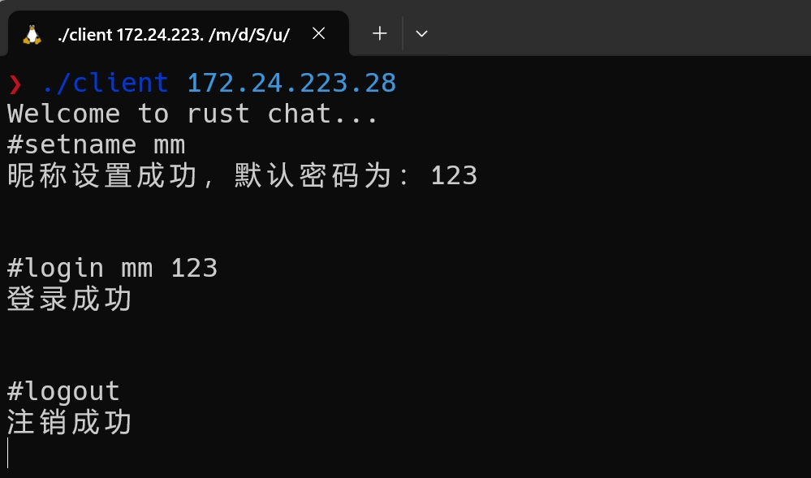
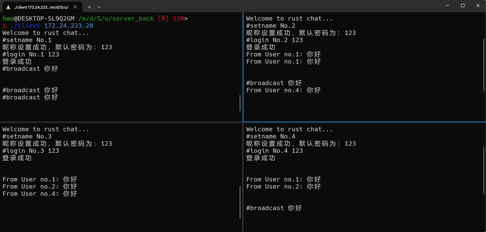

# Rust tcp聊天室

> 该聊天室是一个命令交互式的，client只需实现读取用户键盘输入，接收服务器发送的数据即可。


## 运行

~~~c
cargo run
~~~


## 支持的命令

> 命令是以 # 开头

1. **help**

   ```c
   #help
   ```

   

2. **setname**

   ~~~c
   #setname <user_name>
   ~~~

   

3. **login**

   ~~~c
   #login <user_name> <user_pass>
   ~~~

   

4. **logout**

   ~~~c
   #logout
   ~~~

   

5. **broadcast**

   ~~~c
   #broadcast <string>
   or
   #b <string>
   ~~~

   

## 客户端 Demo

客户端代码可以参考一下代码编写，不仅限于C语言。

```c
#include <stdio.h>
#include <string.h>
#include <pthread.h>
#include <sys/types.h>
#include <sys/socket.h>
#include <netinet/in.h>
#include <unistd.h>
#include <stdlib.h>
#include <arpa/inet.h>

#define MAXLINE 2048

#define max(x, y) ((x) > (y) ? x : (y))

void str_in(int fd)
{
   char tx_buf[MAXLINE], rx_buf[MAXLINE];
   int maxfdpl, stdineof;
   fd_set rset;
   int n;

   stdineof = 0;
   FD_ZERO(&rset);

   while (1) {
      if (0 == stdineof) {
     		FD_SET(fileno(stdin), &rset);
        }
        FD_SET(fd, &rset);
      maxfdpl = max(fileno(stdin), fd) + 1;
       select(maxfdpl, &rset, NULL, NULL, NULL);

       if (FD_ISSET(fd, &rset)) {
           if ((n = read(fd, rx_buf, MAXLINE)) == 0) {
               if (1 == stdineof) {
                   return;
               } else {
                   fprintf(stderr, "str_cli: server terminated prematurely");
                   break;
               }
           }
           write(fileno(stdout), rx_buf, n);
       }

       if (FD_ISSET(fileno(stdin), &rset)) {
           if ((n = read(fileno(stdin), rx_buf, MAXLINE)) == 0) {
               stdineof = 1;
               shutdown(fd, SHUT_WR);
               FD_CLR(fileno(stdin), &rset);
               continue;
           }
           write(fd, rx_buf, n);
       }
   }

}

int main(int argc, char *argv[])
{
    int sockfd, cfd;
    struct sockaddr_in client_addr;

    sockfd = socket(AF_INET, SOCK_STREAM, 0);
    if (sockfd < 0) {
        printf("socket error\n");
        return 0;
    }

    bzero(&client_addr, sizeof(client_addr));
    client_addr.sin_family = AF_INET;
    client_addr.sin_port = htons(8080);
    inet_pton(AF_INET, argv[1], &client_addr.sin_addr);

    cfd = connect(sockfd, (struct sockaddr *)&client_addr, sizeof(client_addr));
    if (cfd < 0) {
        printf("connect error\n");
        return 0;
    }

    str_in(sockfd);
    exit(0);
}
```

